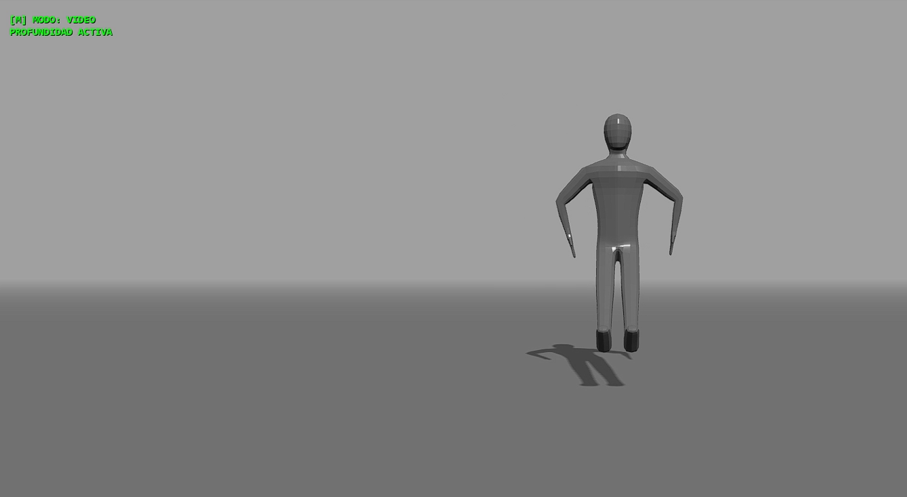
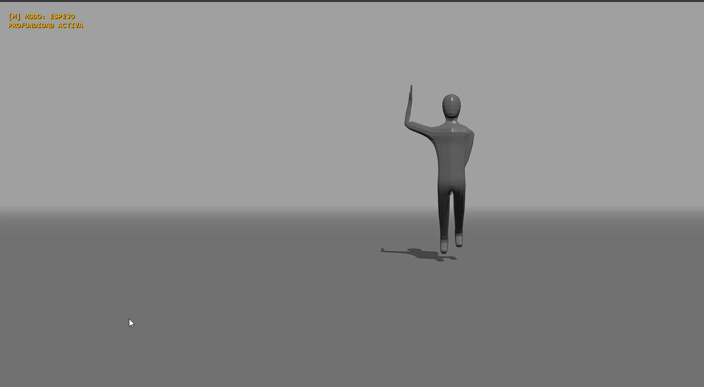

# VC-Trabajo_Final
Proyecto final de la asignatura de Visión por Computador

Este proyecto se divide en varios componentes:

- backend
    - main.py
    - server.py
- frontend
    - index.html
    - main.js

Para el backend usamos un script de python para la captura de movimientos junto al modelo de YOLOV8N-POSE enviando los datos a un websocket y usamos otro script de python para manejar la conexión al websocket.

Los datos enviados al websocket desde el YOLO deben superar la confianza de un 0.5, estos se agrupan en una lista de puntos clave, una vez conocidos estos puntos se escribe un JSON y se envia a la ruta del websocket. Para mejorar el tiempo de respuesta establecimos, que la resolución de la imagen ya que no necesitamos tanta resolución para detectar los huesos, hacemos que YOLO procese una imagen más pequeña internamente y solo dejamos un sleep mínimo para no bloquear al procesador.

El server.py se encarga de controlar y manejar los errores y conexiones entrantes al websocket.

En cuanto el frontend tenemos un html básico en el que ejecuta el script main.js. Este script se encarga de cargar un esqueleto con modelo 3d en una escena. Cuando recibimos el evento del main.py leemos el JSON y mandamos a actualizar el esqueleto, calculamos distancia entre los hombros para hacernos una idea de la profundidad. Dividimos izquierda y derecha para que se vean correctamente por el modelo, hacemos el cálculo para cada articulación. 

Hay 2 modos disponibles un modo espejo en el cual refleja lo que estas haciendo y el otro modo  refleja tus gestos como si fueras el modelo.

Para ejecutar este proyecto usar los siguiente comandos desde la ruta base:

    python /backend/server.py
    python /backend/main.py
    cd /frontend
    python -m http.server 3000